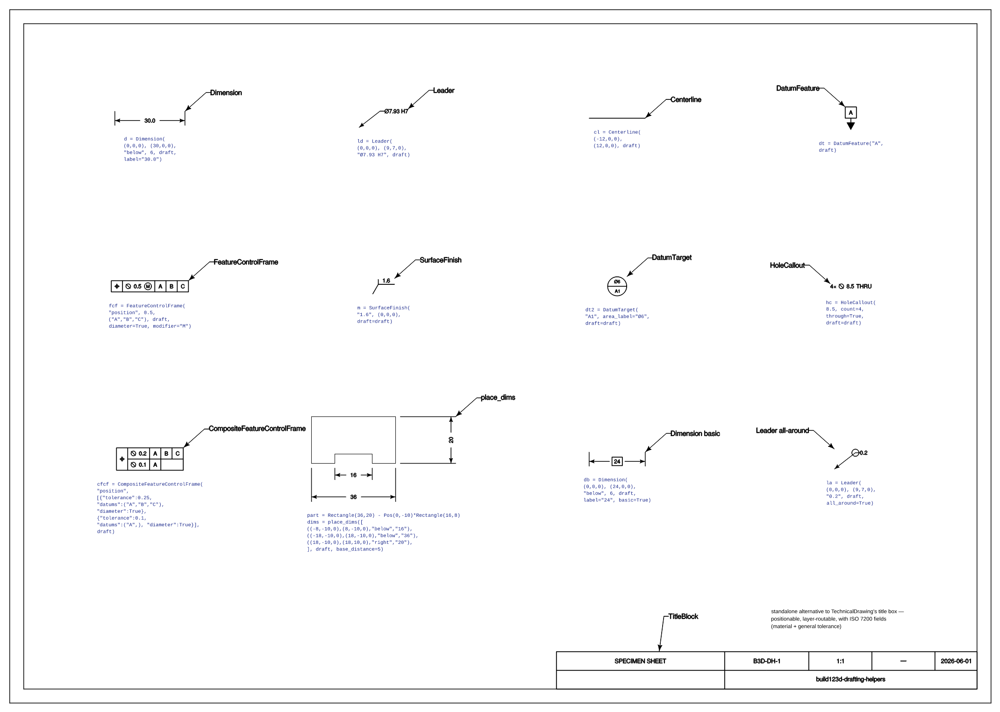
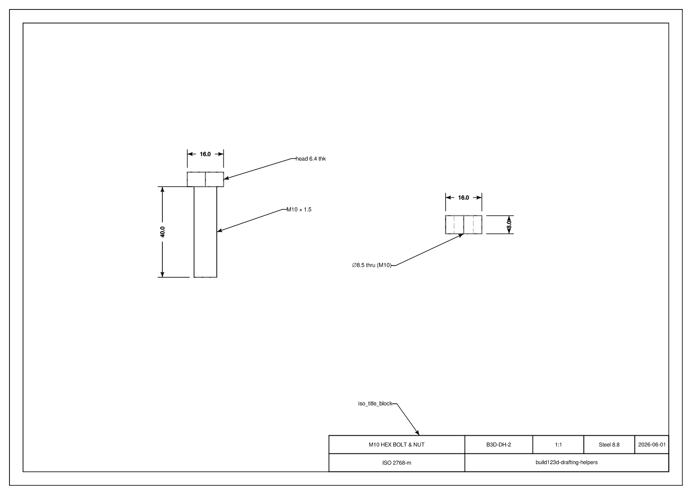

# build123d-drafting-helpers

[](https://pypi.org/project/build123d-drafting-helpers/)
[](https://pypi.org/project/build123d-drafting-helpers/)
[](LICENSE)

Third-party drawing-annotation helpers for [build123d](https://github.com/gumyr/build123d) — pure Python, no MCP dependency. Not affiliated with the upstream build123d project.

```python
from build123d_drafting import (
    dim_linear, place_dims, place_labels, centerline,
    leader, view_axes, lint_drawing,
)
```

The install name is `build123d-drafting-helpers`; the import name is `build123d_drafting`.

> **Not to be confused with [`baverman/build123d_draft`](https://github.com/baverman/build123d_draft)** — that project is *modelling shortcuts* (slot helpers, rotation aliases, `build_line` wrappers), not drafting/annotation. Different scope despite the similar name.

## Installation

```
pip install build123d-drafting-helpers
```

Or with uv:

```
uv add build123d-drafting-helpers
```

Requires `build123d >= 0.7.0` and Python ≥ 3.10.

## Helpers

### `draft_preset(font_size=2.5, decimal_precision=2, **overrides)`

A `Draft` tuned for clean output. build123d's `Draft` defaults draw heavy arrowheads
(`arrow_length=3.0` mm) and thick dimension lines (`line_width=0.5` mm) that look clumsy at
small fonts; this scales the arrowhead to the font (`0.9 * font_size`) and thins the line
(`0.1` mm). Use it as the starting point for every helper that takes a `draft`.

```python
draft = draft_preset(font_size=1.6)                       # light, font-scaled arrows
draft = draft_preset(font_size=3.0, line_width=0.15)      # override any field
```

(On-screen/SVG stroke thickness is separate — set it on the exporter via
`ExportSVG.add_layer(line_weight=...)`.)

---

### `dim_linear(p1, p2, side, distance, draft, label=None, tolerance=None, label_offset_x=0.0)`

`ExtensionLine` wrapper with named placement side instead of raw signed offset.

```python
draft = Draft(font_size=2.5, decimal_precision=1)
dim = dim_linear((-20, -10, 0), (20, -10, 0), "below", 8, draft, label="40")
```

`side` accepts `"above"` / `"below"` / `"left"` / `"right"` or an explicit world-direction vector.
The correct `offset` sign is computed from the path direction's right-hand normal — no guessing.

`label_offset_x` shifts the label along the dim line (mm, signed). Use it to move the label away
from a crossing centreline without changing the dim position or geometry. Positive shifts toward p2.

```python
# Label crosses bore centreline at x=0 — shift it right by 15 mm
dim = dim_linear((-10, 0, 0), (10, 0, 0), "above", 8, draft, label="Ø5.0 H8", label_offset_x=15)
```

Returns a `DimResult(shape, label_str, measured_length, dim_level_y, label_bbox)`.
`label_bbox` is the precise text extent `(min_x, min_y, max_x, max_y)` — used by `lint_drawing`
and `place_labels` for centreline-overlap detection.

---

### `place_dims(specs, draft, base_distance=8.0, tier_spacing=None)`

Build a stack of parallel dims with automatically assigned offsets. No need to compute `distance` manually.

```python
dims = place_dims([
    ((-30, 0, 0), (30, 0, 0), "above", "60"),   # full width  → tier 0 (innermost)
    ((-10, 0, 0), (10, 0, 0), "above", "20"),   # overlaps    → tier 1
    (( 15, 0, 0), (30, 0, 0), "above", "15"),   # non-overlap → tier 0 (shares with first)
], draft)
```

Specs are `(p1, p2, side, label)` or `(p1, p2, side, label, tolerance)` — no `distance`.
Dims whose X/Y spans overlap are placed on successive tiers; non-overlapping dims share a tier.
**Order matters:** specs listed first are placed on lower (inner) tiers.

`tier_spacing` defaults to `draft.font_size * 3 + draft.arrow_length`.

---

### `place_labels(specs, draft, centerlines, gap=1.0)`

Like `place_dims` but also auto-shifts each label to clear any crossing vertical centreline.

```python
bore_cl = centerline((0, -30, 0), (0, 30, 0))   # vertical centreline at x=0

dims = place_labels([
    ((-10, 0, 0), (10, 0, 0), "above", 8, "Ø5.0 H8"),
    ((-20, 0, 0), (20, 0, 0), "above", 18, "40"),
], draft, centerlines=[bore_cl])
```

Specs are `(p1, p2, side, distance, label)` or `(p1, p2, side, distance, label, tolerance)`.
For each dim whose label would cross a centreline, the minimum left/right shift is computed
automatically. Multiple crossing centrelines are handled in one pass.

---

### `centerline(p1, p2)` / `CenterlineResult`

Thin Edge compound representing a centreline, returned as a `CenterlineResult`.

```python
bore_cl = centerline((cx, -50, 0), (cx, 50, 0))   # vertical through bore axis
```

Pass `CenterlineResult` objects to `place_labels(..., centerlines=[bore_cl])` for auto-avoidance,
or pass them to `lint_drawing([...] + [bore_cl])` to get `label_centerline_overlap` warnings.

When working with the MCP server, register centrelines with `register_centerline(shape, name)` so
`lint_drawing()` in session mode can also check them.

---

### `safe_dim_line(path, label, draft, fallback_label=None)`

`DimensionLine` wrapper that won't raise `ValueError` when the label is wider than the dim path.
Truncates gracefully and retries.

---

### `leader(tip, elbow, label, draft)`

Leader annotation built from scratch. The line stops cleanly before the label text.

```python
res = leader((5, 5, 0), (20, 12, 0), "⌀7.93 H7", draft)
exporter.add_shape(res.lines, layer="dims")   # arrowhead + shelf — fill_color layer
exporter.add_shape(res.text,  layer="text")   # glyphs — fill_color layer
```

Returns `LeaderResult(lines, text, label_str, tip, elbow)`. Route `lines` and `text` to
separate SVG layers, both with `fill_color` set.

`leader_offset(tip, direction, length, label, draft)` is a thin wrapper that places the
elbow by compass direction (`"N"`, `"NE"`, …) or numeric angle (degrees CCW from +X) and
a distance, instead of absolute coords — handy when the drawing uses a non-1:1 scale.

```python
res = leader_offset((x, y), "NW", 12, "⌀6 boss", draft)
```

---

### `view_axes(viewport_origin, viewport_up=(0,1,0), look_at=(0,0,0))`

Returns the world→page axis mapping for a `project_to_viewport` call, computed analytically.

```python
axes = view_axes((0, 0, -100), (0, 1, 0), (0, 0, 0))
# {"world_X": ("page_X", -1.0), "world_Y": ("page_Y", 1.0), "world_Z": ("depth", 0.0)}
# ↑ bottom view flips world-X on the page
```

---

### `lint_drawing(items, part_bbox=None)`

Structural checks on a list of `DimResult` / `LeaderResult` / `CenterlineResult` objects:

| Check | Trigger |
|---|---|
| `label_vs_measured` | Label value differs from measured path length by >0.5% — likely axis swap |
| `annotation_overlap` | Two annotations overlap by >0.5 mm in both axes at the same Y level |
| `label_centerline_overlap` | Dim label bbox crosses a `CenterlineResult` — use `label_offset_x` or `place_labels` |
| `dim_inside_part` | Dim bbox overlaps part outline by >10% — dim is inside the view |
| `leader_line_through_text` | Leader elbow point inside label bbox — line strikes through text |

```python
bore_cl = centerline((0, -30, 0), (0, 30, 0))
issues = lint_drawing([dim1, dim2, lea1, bore_cl])
for issue in issues:
    print(issue.severity, issue.message)
```

---

### `feature_control_frame(characteristic, tolerance, datums, draft, diameter=False, modifier=None)`

ISO 1101 feature control frame — the boxed GD&T callout. build123d ships no GD&T primitives, and the
geometric-characteristic symbols (⌖ ⊥ ∥ ◎ …) are absent from CAD-safe fonts, so each is drawn
geometrically rather than as a glyph.

```python
draft = Draft(font_size=2.5, decimal_precision=1)

# | ⌖ | ⌀0.5 Ⓜ | A | B | C |
fcf = feature_control_frame(
    "position", 0.5, ("A", "B", "C"), draft,
    diameter=True,     # prepend ⌀ (cylindrical tolerance zone)
    modifier="M",      # circled M = MMC ("L" = LMC, "P" = projected; None = RFS)
)
exporter.add_shape(fcf.lines, layer="dims")   # frame + symbols — line_color layer
exporter.add_shape(fcf.text,  layer="text")   # values + letters — fill_color layer
```

All 14 characteristics are supported: `straightness`, `flatness`, `circularity`, `cylindricity`,
`profile_line`, `profile_surface`, `angularity`, `perpendicularity`, `parallelism`, `position`,
`concentricity`, `symmetry`, `circular_runout`, `total_runout`.

Per-datum material-condition modifiers are available via `datum_modifiers`, e.g.
`datum_modifiers={"A": "M"}` draws a circled M after datum A's letter.

The frame is built with its bottom-left corner at the origin (height = 2 × font size, per ISO 3098).
Returns `FeatureControlFrameResult(lines, text, characteristic, tolerance_str, datums, width, height)`.
Route `lines` and `text` to separate SVG layers, both with `fill_color` set.

> **Why drawn, not typed:** a frequent failure mode (see build123d-mcp Discord) is building these
> symbols ad-hoc from circles + lines and positioning each by `someRect.center()` — if a referenced
> rectangle resolves to the wrong centre, a symbol silently lands off-frame and "disappears". This
> helper lays out every compartment by explicit arithmetic so nothing depends on fragile lookups.

---

### `datum_feature(letter, draft, filled=True)`

ISO 5459 datum feature symbol: a filled triangle on a short leader to a framed datum letter.
Built with the triangle tip at the origin (pointing −Y); move it onto the feature with `.shape.moved(loc)`.

```python
dat = datum_feature("A", draft)
exporter.add_shape(dat.lines, layer="dims")   # triangle (filled) + box — fill_color layer
exporter.add_shape(dat.text,  layer="text")   # the letter — fill_color layer
```

Returns `DatumFeatureResult(lines, text, letter)`.

---

### `iso_title_block(...)` and `surface_finish_mark(...)`

`iso_title_block` is a **standalone title box** (170 × 16 mm by default), positioned by the caller. It is *not* a substitute for `build123d.TechnicalDrawing`, which is a whole-page chrome — page-sized border + grid ticks + embedded title box, returned as a single `Sketch`. Use `TechnicalDrawing` when you want the full drawing-sheet frame; reach for `iso_title_block` when you want just the title box, positionable anywhere, with separate `lines`/`text` `Compound`s for SVG layer routing, and with `material` / `general_tolerance` fields that `TechnicalDrawing` does not carry.

`surface_finish_mark` produces an ISO 1302 Ra-value check-mark symbol — build123d does not ship one.

## Status against upstream

- `lint_drawing` is a prototype of rule-based drawing checks that build123d's roadmap mentions as future work. If upstream ships its own linter later, this one can be deprecated.
- `dim_linear` is a thin convenience wrapper over `ExtensionLine` — it does not replace the underlying class, it just lets you write `side="above"` instead of computing the right-hand-normal signed offset by hand. If upstream adds a named-side parameter, this helper becomes redundant.

## Examples

[`examples/specimen_sheet.py`](examples/specimen_sheet.py) is an **A3 technical drawing that
catalogues the helpers using the helpers themselves** — a real drawing frame, an
`iso_title_block()` title block, every specimen called out by a `leader()` carrying the
helper's name, all drafted with `draft_preset()`, and each cell captioned with the exact
snippet that produced it:



Run `python examples/specimen_sheet.py` to write `specimen_sheet.svg`, then rasterise it
(resvg, Inkscape, or a browser) to refresh `docs/specimen_sheet.png`. Because the whole sheet
is build123d geometry — text included — it also exports to DXF and scales like any drawing.

### A worked drawing — [`examples/part_drawing.py`](examples/part_drawing.py)

Where the specimen sheet is a *catalogue*, this shows the **end-to-end workflow on a real
part** (an M10 hex bolt + nut): build the 3D part → `project_to_viewport()` views →
dimension with `dim_linear()` / `leader()` → **lint with `find_interferences()`** → export.
An A4 frame, an `iso_title_block()`, projected front views with hidden lines, and the layout
is verified collision-free by `lint()` before it's written.



## Development

```
git clone https://github.com/pzfreo/build123d-drafting-helpers.git
cd build123d-drafting-helpers
uv run pytest tests/
```

## Status

Alpha. API may change. Developed alongside [build123d-mcp](https://github.com/pzfreo/build123d-mcp), which integrates these helpers into its LLM-facing drawing workflow.

## Documentation

- [Drafting conventions and gotchas](docs/drafting-conventions.md) — offset sign table, crash modes, recommended feedback loop, and when to reach for which helper.
